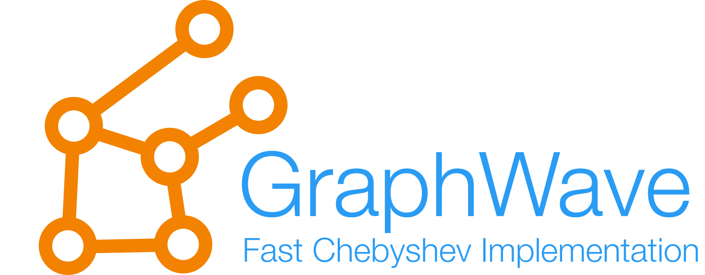

<!--
*** Thanks for checking out the Best-README-Template. If you have a suggestion
*** that would make this better, please fork the repo and create a pull request
*** or simply open an issue with the tag "enhancement".
*** Thanks again! Now go create something AMAZING! :D
***
***
***
*** To avoid retyping too much info. Do a search and replace for the following:
*** leokster, graph_wave, twitter_handle, email, Variational Autoencoder, project_description
-->

<!-- PROJECT SHIELDS -->
<!--
*** I'm using markdown "reference style" links for readability.
*** Reference links are enclosed in brackets [ ] instead of parentheses ( ).
*** See the bottom of this document for the declaration of the reference variables
*** for contributors-url, forks-url, etc. This is an optional, concise syntax you may use.
*** https://www.markdownguide.org/basic-syntax/#reference-style-links
-->
[![Contributors][contributors-shield]][contributors-url]
[![Forks][forks-shield]][forks-url]
[![Stargazers][stars-shield]][stars-url]
[![Issues][issues-shield]][issues-url]
<!--[![MIT License][license-shield]][license-url]
[![LinkedIn][linkedin-shield]][linkedin-url1]
[![LinkedIn][linkedin-shield]][linkedin-url2]-->

<!-- PROJECT LOGO -->
 

  

  <h3 align="center">Fast node embedding algorithm. Implementation of GraphWave [1]</h3>

  

    [1] <a href="http://snap.stanford.edu/graphwave/">snap.stanford.edu/graphwave/</a>
     
    <!--<a href="https://github.com/leokster/graph_wave"><strong>Explore the docs »</strong></a>
     -->
     
    <a href="https://github.com/leokster/graph_wave/tree/main/examples">View Demo</a>
    ·
    <a href="https://github.com/leokster/graph_wave/issues">Report Bug</a>
    ·
    <a href="https://github.com/leokster/graph_wave/issues">Request Feature</a>
  

<!-- TABLE OF CONTENTS 

  
<h2 style="display: inline-block">Table of Contents</h2>

  <ol>
    <li>
      
      <ul>
        <li><a href="#built-with">Built With</a></li>
      </ul>
    </li>
    <li>
      <a href="#getting-started">Getting Started</a>
      <ul>
        <li><a href="#prerequisites">Prerequisites</a></li>
        <li><a href="#installation">Installation</a></li>
      </ul>
    </li>
    <li><a href="#usage">Usage</a></li>
    <li><a href="#roadmap">Roadmap</a></li>
    <li><a href="#contributing">Contributing</a></li>
    <li><a href="#license">License</a></li>
    <li><a href="#contact">Contact</a></li>
    <li><a href="#acknowledgements">Acknowledgements</a></li>
  </ol>

-->

<!-- ABOUT THE PROJECT -->
## GraphWave Implementation

GraphWave [1] is a node embedding algorithm proposed 
Claire Donnat, Marinka Zitnik, David Hallac, and Jure 
Leskovec in 2018. It uses techniques from discrete signal
processing. The here published version uses a fast Chebyshev
approximation of the propagated graph signal. Furthermore, 
we have built some simple visualization framewokrs such that
the propagating graph signal can easily be visualized.

### Examples

![animation][animation]

A random graph with a delta wavelet on one single node. The color shows
the heat spreading (note: the color scale changes in time).

![embedding][embedding]

The 2d principle component analysis (PCA) of the node embeddings.

<!-- LICENSE -->
## License

Distributed under the MIT License.

<!-- CONTACT -->
## Contact

Tim Rohner - tim.rohner@smartmind.ch

Project Link: [https://github.com/leokster/graph_wave](https://github.com/leokster/graph_wave)

<!-- MARKDOWN LINKS & IMAGES -->
<!-- https://www.markdownguide.org/basic-syntax/#reference-style-links -->
[contributors-shield]: https://img.shields.io/github/contributors/leokster/graph_wave.svg?style=for-the-badge
[contributors-url]: https://github.com/leokster/graph_wave/graphs/contributors
[forks-shield]: https://img.shields.io/github/forks/leokster/graph_wave.svg?style=for-the-badge
[forks-url]: https://github.com/leokster/graph_wave/network/members
[stars-shield]: https://img.shields.io/github/stars/leokster/graph_wave.svg?style=for-the-badge
[stars-url]: https://github.com/leokster/graph_wave/stargazers
[issues-shield]: https://img.shields.io/github/issues/leokster/graph_wave.svg?style=for-the-badge
[issues-url]: https://github.com/leokster/graph_wave/issues
[license-shield]: https://img.shields.io/github/license/leokster/graph_wave.svg?style=for-the-badge
[license-url]: https://github.com/leokster/graph_wave/blob/master/LICENSE.txt
[linkedin-shield]: https://img.shields.io/badge/-LinkedIn-black.svg?style=for-the-badge&logo=linkedin&colorB=555
[linkedin-url1]: https://linkedin.com/in/tim-rohner
[linkedin-url2]: https://linkedin.com/in/koen-van-walstijn
[logo]: images/logo.png
[animation]: images/output.gif
[embedding]: images/embedding.png